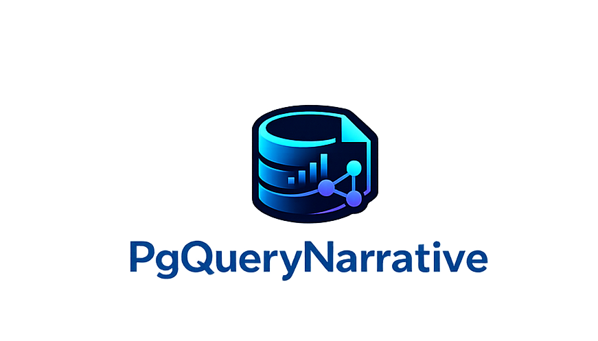

<p align="center">
  
</p>

<h1 align="center">PgQueryNarrative</h1>

<p align="center">
Turn SQL query results into business narratives with AI.<br>
Run read-only SQL against PostgreSQL, get metrics and chart suggestions, and generate narrative reports using your choice of LLM (Ollama, OpenAI, Claude, Gemini, Groq).
</p>

---

## Overview

PgQueryNarrative is a Go application that executes read-only SQL against a PostgreSQL database, computes metrics (aggregates, time-series, period comparison, anomaly detection), suggests chart types from result structure, and generates narrative reports via a configurable LLM. The [React SPA](frontend/) provides a query editor, saved queries, reports list, and export (HTML/PDF). The REST API and [CLI](docs/usage/cli-usage.md) support automation and integration.

## Quick start

**Docker (PostgreSQL + app in containers):**

```bash
make start-docker
```

**Local PostgreSQL** (app on host; Postgres must be running):

```bash
make start-local
```

Then open **http://localhost:8080** for the web UI or call the API ([API examples](docs/api/examples.md)):

```bash
curl -X POST http://localhost:8080/api/v1/queries/run \
  -H "Content-Type: application/json" \
  -d '{"sql": "SELECT product_category, SUM(total_amount) AS total FROM demo.sales GROUP BY product_category", "limit": 10}'
```

Report generation requires an [LLM](docs/getting-started/llm-setup.md). See [Configuration](docs/configuration.md) for all environment variables.

## Requirements

- **Docker** (for `make start-docker`), or **PostgreSQL 16+** and **Go 1.24+** (for `make start-local` and building).
- For the full web UI from source: **Node.js** and **npm** (to build the [frontend](frontend/)).

## Commands

| Action | Command |
|--------|--------|
| Start (Docker) | `make start-docker` |
| Start (local) | `make start-local` |
| Stop | `make stop` |
| Build | `make build` (frontend + server) |
| Test | `make test` |
| CLI | `make cli CMD='query "SELECT * FROM demo.sales LIMIT 5"'` |

## Project structure

| Path | Purpose |
|------|---------|
| [`cmd/server`](cmd/server) | Application entrypoint; serves API, health/ready, web export, React SPA |
| [`app/`](app/) | Core logic: config, DB, [query runner](app/queryrunner), [metrics](app/metrics), [LLM](app/llm), [narrative](app/story), [service](app/service) |
| [`api/design/`](api/design/) | [Goa](https://goa.design/) API design; generated code in `api/gen/` and root `gen/` |
| [`frontend/`](frontend/) | React SPA (Vite, Tailwind CSS, shadcn/ui); built to `frontend/dist`, served by Go at `/` |
| [`web/`](web/) | Server-side web handlers (report export: [HTML](web/handlers.go), [PDF](web/pdf.go)) |
| [`pkg/narrative/`](pkg/narrative/) | Library client and middleware for [embedded integration](docs/getting-started/embedded.md) |
| [`docs/`](docs/README.md) | Documentation |
| [`test/unit/`](test/unit/), [`test/integration/`](test/integration/), [`test/e2e/`](test/e2e/) | Tests |
| [`changelog/`](changelog/) | Release history |

## Documentation

Full documentation in **[docs/](docs/README.md)**:

| Section | Links |
|---------|--------|
| **Getting started** | [Installation](docs/getting-started/installation.md) · [Quick start](docs/getting-started/quickstart.md) · [LLM setup](docs/getting-started/llm-setup.md) · [Embedded integration](docs/getting-started/embedded.md) |
| **User guides** | [Configuration](docs/configuration.md) · [CLI usage](docs/usage/cli-usage.md) |
| **API** | [Reference](docs/api/README.md) · [Examples](docs/api/examples.md) |
| **Reference** | [Deployment](docs/reference/deployment.md) · [Operations](docs/reference/operations.md) · [Troubleshooting](docs/reference/troubleshooting.md) · [PostgreSQL extension](docs/reference/postgres-extension.md) · [Semantic search (pgvector)](docs/reference/semantic-search-pgvector.md) |
| **Development** | [Setup](docs/development/setup.md) · [Testing](docs/development/testing.md) |

**Contributing & security:** [.github/CONTRIBUTING.md](.github/CONTRIBUTING.md) · [.github/SECURITY.md](.github/SECURITY.md). **Changelog:** [CHANGELOG.md](CHANGELOG.md).

## License

MIT. See [LICENSE](LICENSE).
