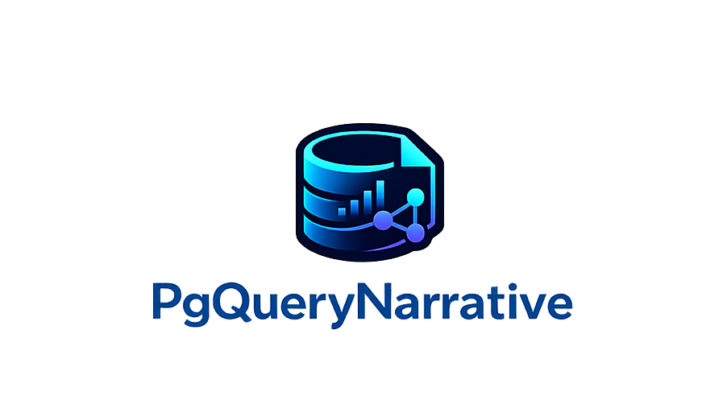

<p align="center">
  
</p>

<h1 align="center">PgQueryNarrative</h1>

<p align="center">
<strong>PostgreSQL query intelligence that shows its evidence</strong><br>
Investigate expensive queries, compare system-proposed rewrites with plan proof,<br>
and ship engineering-ready reports.
</p>

<p align="center">
  <a href="https://github.com/pgquery-narrative/pgquerynarrative/actions"></a>
  
  
  
  <a href="https://github.com/pgquery-narrative/pgquerynarrative/pkgs/container/pgquerynarrative"></a>
  <a href="https://github.com/pgquery-narrative/pgquerynarrative/releases"></a>
  <a href=".github/SECURITY.md"></a>
</p>

<p align="center">
  <a href="#install"><strong>Install</strong></a> ·
  <a href="#try-it-5-minutes">Try the demo</a> ·
  <a href="docs/getting-started/connect-postgres.md">Connect your Postgres</a> ·
  <a href="docs/reference/deployment.md">Deploy</a> ·
  <a href="https://pgquery-narrative.github.io/pgquerynarrative/">Documentation</a> ·
  <a href=".github/SECURITY.md">Security</a>
</p>

<p align="center">
  
</p>

<p align="center"><sub>Investigate → system-proposed rewrite → compare with plan proof → engineering report.</sub></p>

---

## What it is

PgQueryNarrative is a **PostgreSQL investigation workbench**. The flagship loop is:

**expensive query → plan findings → system-proposed rewrite or index candidate → measured compare + equivalence proof → engineering report**

Safe read-only SQL and plan analysis are the core. An optional LLM can narrate workbench analytics; it is **not** required for investigation reports (those are evidence templates, not LLM narratives). Start with [Concepts](docs/concepts.md) for vocabulary (evidence, EXPLAIN vs ANALYZE, what compare proves).

**Where this fits**

Query-statistics dashboards, regression alerting, plan scoring and automated
query rewriting all have mature tools already, commercial and open source. If
that is what you need, reach for one of them. What this adds is narrow and
specific:

> **It proposes a rewrite and then proves the rows still match before you ship it.**

The rewriter is a rule engine over PostgreSQL's own parser — about six patterns,
no model involved — and it **declines more often than it fires**, because it only
transforms what it can show is equivalent. Verification then runs both queries
and compares every row with an order-independent checksum. If it cannot prove
equality it says `Unverified`, which is a different answer from `Different`.

If your slow query is not one of the shapes below, you will get plan findings
and no rewrite. That is the expected outcome, not a failure.

**How it works (honest):**

- Rewrites are **proposed from the query AST and plan findings** (`Suggest rewrite` / `Rank candidates`) — demo scenarios ship **problem SQL only**, no answer-key rewrite
- **Coverage is bounded and deliberately conservative.** The patterns are: a function
  wrapping a filtered column (`DATE_TRUNC` / `EXTRACT` / `to_char` / `::date` / `COALESCE`
  over a date), numeric and text casts on a compared column, `OR` across columns →
  `UNION ALL`, `IN` / `NOT IN` → `EXISTS`, and `LEFT JOIN … IS NULL` → `NOT EXISTS`.
  It refuses when it cannot prove the transform safe — an anti-join whose `IS NULL`
  column is not the join key, or one whose right-hand table is still selected, is
  left alone
- **Planner cost is labelled an estimate, never a speed multiple.** Cost is in arbitrary
  units and is not proportional to time; only `EXPLAIN ANALYZE` produces a measured
  duration, and a single run is reported as the single sample it is
- Index DDL is **suggested only** (hypopg when installed; labeled heuristic otherwise) — never auto-applied
- **Equivalence** is reported in five states — `VerifiedEqual` (every row matched),
  `SampleMatch` (a bounded sample matched, for results past the 1000-row cap), `Different`,
  `Unverified` (the check could not complete — never reported as a mismatch), and
  `NotRequested`. Only `VerifiedEqual` or `SampleMatch` gates a shippable investigation report
- **Regression inbox** is empty on default `make demo` unless real `pg_stat_statements` data exists; set `APP_ENV=demo` for seeded demo alerts and KPIs

## Choose your path

| You want to… | Start here |
|--------------|------------|
| **Install it** | [Install](#install) — container, binary, or source |
| **Try it in ~5 minutes** | [Try it](#try-it-5-minutes) — `make demo` + guided Investigate |
| **Connect your PostgreSQL** | [Connect your Postgres](docs/getting-started/connect-postgres.md) — readonly role + schema allowlist |
| **Deploy** | [Deployment](docs/reference/deployment.md) — Docker / Compose / Kubernetes |
| **Understand trust & scope** | [Trust model](docs/trust-model.md) — what the app will and will not do |

---

## Install

Three ways in, in order of how quickly you get a running instance.

### Container (recommended)

```bash
docker pull ghcr.io/pgquery-narrative/pgquerynarrative:2.1.0
```

One image carries the API and the built UI. It needs a PostgreSQL to talk to, and
on a fresh database it needs `DATABASE_MIGRATION_USER` / `DATABASE_MIGRATION_PASSWORD`
set to a role that may create extensions and alter roles — the runtime query role
deliberately cannot. See [Deployment](docs/reference/deployment.md) for the full
compose file, Helm chart and Kubernetes manifests.

Images are published with an SBOM and signed with cosign:

```bash
cosign verify ghcr.io/pgquery-narrative/pgquerynarrative:2.1.0 \
  --certificate-identity-regexp 'https://github.com/pgquery-narrative/pgquerynarrative/.*' \
  --certificate-oidc-issuer https://token.actions.githubusercontent.com
```

### Binary

Download the archive for your platform from the
[latest release](https://github.com/pgquery-narrative/pgquerynarrative/releases/latest)
— `linux-amd64`, `linux-arm64`, `darwin-amd64`, `darwin-arm64` — then:

```bash
tar -xzf pgquerynarrative-2.1.0-linux-amd64.tar.gz
cd pgquerynarrative-2.1.0-linux-amd64
sha256sum -c ../checksums.txt --ignore-missing   # verify first
cp config/pgquerynarrative.env.example .env      # then edit the DATABASE_* values

# Migrations create extensions and ALTER ROLE, so they need a role that may do
# both — not the runtime query role, which deliberately cannot.
./bin/migrate -path app/db/migrations -database "$MIGRATION_DATABASE_URL" up
./bin/pgquerynarrative-server
```

Each archive ships the server, the MCP server, a `migrate` binary, the migrations
themselves, the built UI, and an example config — so a release is self-contained
and does not need this repository.

Every archive, plus `checksums.txt` and the SBOM, is signed. Each has a
`.cosign.bundle` beside it holding the signature and certificate:

```bash
cosign verify-blob pgquerynarrative-2.1.0-linux-amd64.tar.gz \
  --bundle pgquerynarrative-2.1.0-linux-amd64.tar.gz.cosign.bundle \
  --certificate-identity-regexp 'https://github.com/pgquery-narrative/pgquerynarrative/.*' \
  --certificate-oidc-issuer https://token.actions.githubusercontent.com
```

### From source

Requires Go 1.26+ and CGO (`pg_query_go` is a cgo library), plus Node 22 for the UI.

```bash
git clone https://github.com/pgquery-narrative/pgquerynarrative.git
cd pgquerynarrative
make build            # builds the UI, then the server into bin/
```

> **Upgrading from 2.0.x?** The schema gate moved to version 56. Run the
> migrations before starting the new binary — a server whose database is behind
> that number refuses to boot. `POST /api/v1/queries/explain` also no longer
> returns `execution_time_ms`; see the [changelog](CHANGELOG.md#210---2026-09-06) for the
> replacement fields.

---

## Try it (5 minutes)

Requires Docker. Starts Postgres + app + small seed (~2 minutes):

```bash
make demo
```

Open **http://localhost:8080**:

1. **Start guided demo** or open **Investigate**
2. Choose **Slow dashboard query**
3. Review the finding (e.g. `DATE_TRUNC` blocking partition pruning)
4. Click **Suggest rewrite** (or **Rank candidates**) — rewrites are system-proposed, not prefilled
5. **Compare plans** with result verification on, and confirm equivalence is **VerifiedEqual**
6. **Generate report**

The demo seeds ~300k rows across 50 monthly partitions (~55 MB) — enough that the
before/after difference is real rather than timing noise. For the 10M-row figures
in the case study, run **`make demo-bootstrap`** first (or `make seed-large-docker`
on an existing stack), then repeat from step 2.

```bash
make demo-bootstrap
```

`make demo` also starts **Ollama** and pulls `llama3.2` so **Ask in natural language** works locally (first run may download the model). Investigation still works if you skip the LLM.

More detail: [Quick start](docs/getting-started/quickstart.md)

---

## Trust model (short)

- User SQL runs as a **dedicated read-only role**, not the app migration user
- Schemas are **allowlisted** (`DATABASE_ALLOWED_SCHEMAS`, default `demo`)
- **Writes and DDL are blocked** in the query validator
- Cloud LLM row egress is **off unless you explicitly enable it**

Full write-up: [Trust model](docs/trust-model.md)

---

## Capabilities

| Area | What you get |
|------|----------------|
| **Query Investigation** | EXPLAIN findings, system-proposed candidates, compare, equivalence proof, template engineering report |
| **Rewrite engine** | AST-based `Suggest rewrite` (DATE_TRUNC, EXTRACT, COALESCE, OR→UNION ALL, IN→EXISTS, …) |
| **Candidate ranking** | `Rank candidates`: dry-EXPLAIN rewrites + optional hypopg index projection (heuristic when hypopg unavailable) |
| **Equivalence proof** | One aggregate pass per side (`count` + `sum` + `bit_xor` over a per-row hash) compares **every row**, order-independently, with no sort → `VerifiedEqual` / `SampleMatch` / `Different` / `Unverified` / `NotRequested`; reports require one of the first two |
| **Secure read-only access** | Readonly pool, statement limits, timeouts, schema allowlist |
| **Plan analysis** | Seq-scan / cost / partition-pruning findings; optional `EXPLAIN ANALYZE` when enabled; IndexAdvice DDL (suggest-only) |
| **Workbench** | Plan tree, compare table, regression inbox (real stats or `APP_ENV=demo`), Security & Trust page |
| **Scale demo** | Partitioned `demo.sales`; 10M-row seed — [Dataset](docs/DATASET.md) |

**Two report types:** **Investigation reports** (evidence template, no LLM) vs **Workbench LLM reports** (`/reports/generate`, Ask). Optional narratives: [LLM setup](docs/getting-started/llm-setup.md) · library embed: [Embedded integration](docs/getting-started/embedded.md)

---

## Commands

| Action | Command |
|--------|---------|
| **Guided demo** | `make demo` |
| Guided demo + 10M-row seed | `make demo-bootstrap` |
| API smoke after demo | `make demo-smoke` |
| Start / stop stack | `make start-docker` / `make stop` |
| Migrate (Docker) | `make migrate-docker` |
| Seed 10M rows (Docker) | `make seed-large-docker` |
| Local app (Postgres already up) | `make start-local` |
| Build / test | `make build` / `make test` |
| CLI | `make cli CMD='query "SELECT * FROM demo.sales LIMIT 5"'` |

---

## Project structure

| Path | Purpose |
|------|---------|
| [`cmd/server`](cmd/server) | API, health/ready, SPA |
| [`cmd/mcp-server`](cmd/mcp-server) | Optional MCP server (query/report tools) |
| [`app/`](app/) | Config, DB, query runner, investigations, LLM, reports |
| [`api/design/`](api/design/) | Goa API design → `api/gen/` and repo-root `gen/` |
| [`frontend/`](frontend/) | React workbench |
| [`web/`](web/) | Report HTML/PDF export handlers |
| [`docs/`](docs/index.md) | Documentation (preview: `make docs`) |
| [`pkg/narrative/`](pkg/narrative/) | Embeddable client |
| [`test/`](test/) | Unit, integration, e2e, Playwright |

---

## Documentation

Preview: **`make docs`** → http://localhost:8000

| Section | Links |
|---------|--------|
| **Start here** | [Docs overview](docs/index.md) · [Concepts](docs/concepts.md) · [Trust model](docs/trust-model.md) |
| **Getting started** | [Quick start](docs/getting-started/quickstart.md) · [Installation](docs/getting-started/installation.md) · [Connect Postgres](docs/getting-started/connect-postgres.md) · [LLM setup](docs/getting-started/llm-setup.md) |
| **Product** | [UI overview](docs/ui-overview.md) · [Configuration](docs/configuration.md) |
| **API** | [Reference](docs/api/README.md) · [Examples](docs/api/examples.md) |
| **Ops** | [Deployment](docs/reference/deployment.md) · [Operations](docs/reference/operations.md) · [Troubleshooting](docs/reference/troubleshooting.md) |
| **Develop** | [Setup](docs/development/setup.md) · [Testing](docs/development/testing.md) · [Dev runbook](docs/development/runbook.md) |
| **Evidence** | [Dataset](docs/DATASET.md) · [Case study](docs/case-studies/01-query-optimization.md) |

**Contributing & security:** [.github/CONTRIBUTING.md](.github/CONTRIBUTING.md) · [.github/SECURITY.md](.github/SECURITY.md) · **Changelog:** [CHANGELOG.md](CHANGELOG.md)

## Releases

| Release | Notes |
|---------|-------|
| **[v2.1.0](https://github.com/pgquery-narrative/pgquerynarrative/releases/tag/v2.1.0)** — current | Query Investigation: rewrite proposals, plan-proof compare, result equivalence, regression inbox. Contains one breaking API change — see [CHANGELOG](CHANGELOG.md#210---2026-09-06) |
| [v2.0.0](https://github.com/pgquery-narrative/pgquerynarrative/releases/tag/v2.0.0) | EXPLAIN analysis, parser-based validation, 10M-row partitioned dataset |
| [v1.0.0](https://github.com/pgquery-narrative/pgquerynarrative/releases/tag/v1.0.0) | Analytics narratives over a read-only connection |

Versioning follows [SemVer](https://semver.org/), scoped to the embeddable
`pkg/narrative` client — see the [stability table](docs/reference/versioning-and-releases.md).
`main` is the development branch; `stable-v2.0.0` and `stable-v1.0.0` preserve the
earlier lines.

## License

MIT. See [LICENSE](LICENSE).
